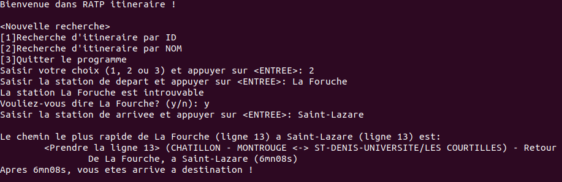

# Road network planner

In this project, we want to build an itinerary planner using the Paris Métro network. Given two metros stations name or ID, we find the shortest itinerary using Dijkstra algorithm. 

## Building

1. git clone https://github.com/StephaneSobucki/Road-network-planner
2. cd Road-network-planner
3. make

The executable is located in bin/

## How to use

1. cd bin
2. ./road_network_planner ../data/s.csv ../data/c.csv 

s.csv contains the metro stations
c.csv contains the connections between metro stations and their respective cost

You can create your own csv files as long as you respect the header.

## Example

The Levenshtein distance is also implemented to check for spelling errors in the input of the user. 

You can see it work in the example above: La Foruche -> La Fourche
